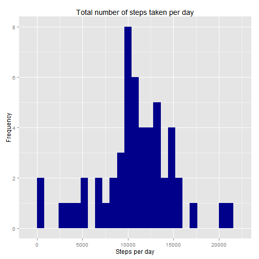
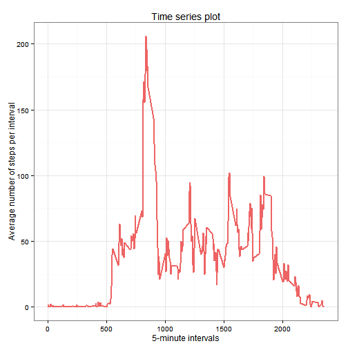
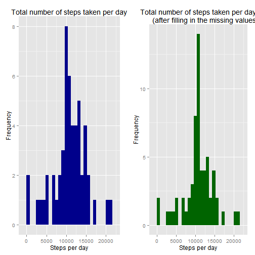
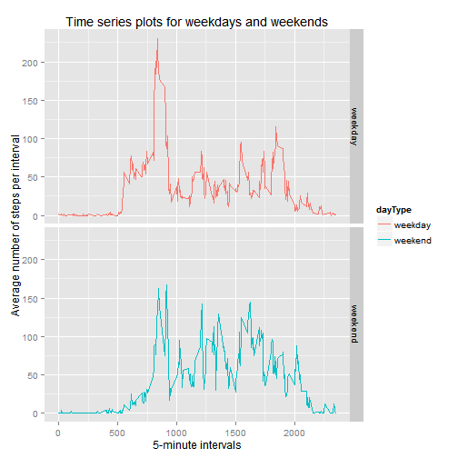

## Introduction

This assignment makes use of data from a personal activity monitoring device. 
This device collects data at 5 minute intervals through out the day. The data 
consists of two months of data from an anonymous individual collected during 
the months of October and November, 2012 and include the number of steps taken 
in 5 minute intervals each day.

## Initial settings


```r
echo = TRUE

library(lubridate)
library(ggplot2)
library(gridExtra)
library(dplyr)
```

```
## 
## Attaching package: 'dplyr'
## 
## The following objects are masked from 'package:lubridate':
## 
##     intersect, setdiff, union
## 
## The following objects are masked from 'package:stats':
## 
##     filter, lag
## 
## The following objects are masked from 'package:base':
## 
##     intersect, setdiff, setequal, union
```

## Loading and preprocessing the data
The file "activity.csv" must be downloaded, unziped, and saved in your working 
directory. Otherwise, please first download the file from [here](https://github.com/rdpeng/RepData_PeerAssessment1), 
unzip it, and save it to your working directory.  

The variables included in this dataset are:

- steps: Number of steps taking in a 5-minute interval (missing values are coded 
as NA)

- date: The date on which the measurement was taken in YYYY-MM-DD format

- interval: Identifier for the 5-minute interval in which measurement was taken  


```r
activity <- read.csv("./activity.csv", header = TRUE, sep = ',', 
                     colClasses = c("integer", "Date", "integer"))
head(activity)
```

```
##   steps       date interval
## 1    NA 2012-10-01        0
## 2    NA 2012-10-01        5
## 3    NA 2012-10-01       10
## 4    NA 2012-10-01       15
## 5    NA 2012-10-01       20
## 6    NA 2012-10-01       25
```

## What is mean total number of steps taken per day?

For this part of the assignment, you can ignore the missing values in the dataset.

1. Calculate the total number of steps taken per day


```r
steps_per_date <- aggregate(steps ~ date, activity, sum)
head(steps_per_date)
```

```
##         date steps
## 1 2012-10-02   126
## 2 2012-10-03 11352
## 3 2012-10-04 12116
## 4 2012-10-05 13294
## 5 2012-10-06 15420
## 6 2012-10-07 11015
```

2. Make a histogram of the total number of steps taken each day


```r
p1 <- ggplot(steps_per_date, aes(x = steps)) +
  geom_histogram(fill = "darkblue", binwidth = 800) +
  labs(title = "Total number of steps taken per day", x = "Steps per day", y = "Frequency")
p1
```

 

3. Calculate and report the mean and median of the total number of steps taken per day

The average total number of steps per day is:

```r
mean(steps_per_date$steps, na.rm=TRUE)
```

```
## [1] 10766.19
```
The median of total number of steps per day is:

```r
median(steps_per_date$steps, na.rm=TRUE)
```

```
## [1] 10765
```

## What is the average daily activity pattern?

1. Make a time series plot of the 5-minute interval and the average number of 
steps taken, averaged across all days


```r
steps_per_interval <- aggregate(steps ~ interval, activity, FUN = "mean")
head(steps_per_interval)
```

```
##   interval     steps
## 1        0 1.7169811
## 2        5 0.3396226
## 3       10 0.1320755
## 4       15 0.1509434
## 5       20 0.0754717
## 6       25 2.0943396
```

```r
ggplot(steps_per_interval, aes(interval, steps)) + theme_bw() +
        geom_line(color = "indianred2", size = 0.8) + 
        labs(title = "Time series plot", x = "5-minute intervals", 
             y = "Average number of steps per interval")
```

 

2. Which 5-minute interval, on average across all the days in the dataset, 
contains the maximum number of steps?


```r
steps_per_interval[which.max(steps_per_interval$steps),]
```

```
##     interval    steps
## 104      835 206.1698
```
Hence, the 5-minute interval with the maximum number of steps is the interal: 835

## Imputing missing values
Note that there are a number of days/intervals where there are missing values (coded as NA). The presence of missing days may introduce bias into some calculations or summaries of the data.

1. Calculate and report the total number of missing values in the dataset 


```r
sum(is.na(activity))
```

```
## [1] 2304
```
So this dataset contains 2304 missing values.

2. Devise a strategy for filling in all of the missing values in the dataset.  
The strategy that we followed is to fill in a missing value with the average 
number of steps taken in the same 5-minute interval.

3. Create a new dataset that is equal to the original dataset but with the 
missing data filled in


```r
activity_new <- activity 
for (i in 1:nrow(activity_new)) {
    if (is.na(activity_new$steps[i])) {
        activity_new$steps[i] <- steps_per_interval[which(activity_new$interval[i] 
                                 == steps_per_interval$interval), ]$steps
    }
}
head(activity_new)
```

```
##       steps       date interval
## 1 1.7169811 2012-10-01        0
## 2 0.3396226 2012-10-01        5
## 3 0.1320755 2012-10-01       10
## 4 0.1509434 2012-10-01       15
## 5 0.0754717 2012-10-01       20
## 6 2.0943396 2012-10-01       25
```
We check if there are any missing value in our new dataset

```r
sum(is.na(activity_new))
```

```
## [1] 0
```

4. Make a histogram of the total number of steps taken each day and calculate 
and report the mean and median total number of steps taken per day. Do these 
values differ from the estimates from the first part of the assignment? What 
is the impact of imputing missing data on the estimates of the total daily 
number of steps?


```r
steps_per_date_new <- aggregate(steps ~ date, activity_new, sum)
head(steps_per_date_new)
```

```
##         date    steps
## 1 2012-10-01 10766.19
## 2 2012-10-02   126.00
## 3 2012-10-03 11352.00
## 4 2012-10-04 12116.00
## 5 2012-10-05 13294.00
## 6 2012-10-06 15420.00
```

```r
p2 <- ggplot(steps_per_date_new, aes(x = steps)) +
  geom_histogram(fill = "darkgreen", binwidth = 800) +
  labs(title = "Total number of steps taken per day
       (after filling in the missing values)", x = "Steps per day", y = "Frequency")
grid.arrange(p1, p2, ncol=2)
```

 
As expected, the total number of steps per day may be
increased when we fill in the missing values with the average 
number of steps taken in the same 5-minute interval.

The average total number of steps per day, after fill in the missing values, is:

```r
mean(steps_per_date_new$steps)
```

```
## [1] 10766.19
```
The median of total number of steps per day, after fill in the missing values, is:

```r
median(steps_per_date_new$steps)
```

```
## [1] 10766.19
```

We notice that the average total number of steps per day is not affected by fill
in the missing values with the average number of steps taken in the the same 
5-minute interval. Moreover, we see that the new median is slightly higher than
the old median. 

## Are there differences in activity patterns between weekdays and weekends?

Note that we used the dataset with the filled-in missing values for this part.

1. Create a new factor variable in the dataset with two levels - "weekday" and 
"weekend" indicating whether a given date is a weekday or weekend day.


```r
activity_new$dayType <- weekdays(activity_new$date)
for (i in 1:nrow(activity_new)) {
    if (activity_new$dayType[i] %in% c("Saturday", "Sunday")) {
        activity_new$dayType[i] <- "weekend"
    } else {activity_new$dayType[i] <- "weekday"}
}
head(activity_new)
```

```
##       steps       date interval dayType
## 1 1.7169811 2012-10-01        0 weekday
## 2 0.3396226 2012-10-01        5 weekday
## 3 0.1320755 2012-10-01       10 weekday
## 4 0.1509434 2012-10-01       15 weekday
## 5 0.0754717 2012-10-01       20 weekday
## 6 2.0943396 2012-10-01       25 weekday
```

2. Make a panel plot containing a time series plot of the 5-minute interval and 
the average number of steps taken, averaged across all weekday days or weekend 
days.


```r
steps_per_dayType_interval <- aggregate(steps ~ interval + dayType, activity_new, mean)
head(steps_per_dayType_interval)
```

```
##   interval dayType      steps
## 1        0 weekday 2.25115304
## 2        5 weekday 0.44528302
## 3       10 weekday 0.17316562
## 4       15 weekday 0.19790356
## 5       20 weekday 0.09895178
## 6       25 weekday 1.59035639
```

```r
ggplot(steps_per_dayType_interval, aes(interval, steps, color = dayType)) + 
        geom_line() + facet_grid(dayType ~ .) +
    labs(title = "Time series plots for weekdays and weekends", x = "5-minute intervals", 
             y = "Average number of steps per interval")
```

 
